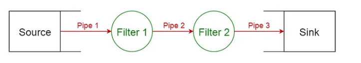
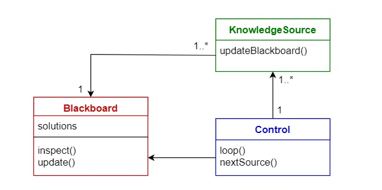
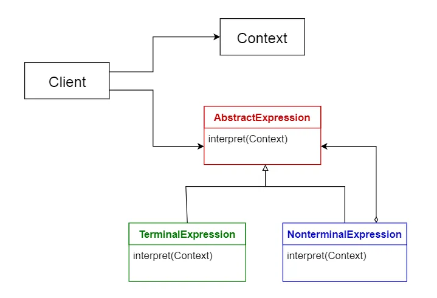

##  架构设计
### General 10 Patterns
1. Layered pattern
2. Client-server pattern
3. Master-slave pattern
4. Pipe-filter pattern
5. Broker pattern
6. Peer-to-peer pattern
7. Event-bus pattern
8. Model-view-controller pattern
9. Blackboard pattern
10. Interpreter pattern

#### Layerer pattern
This pattern can be used to structure programs that can be decomposed into groups of subtasks, each of which is at a particular level of abstraction. Each layer provides services to the next higher layer.

The most commonly found 4 layers of a general information system are as follows.

- Presentation layer (also known as UI layer)
- Application layer (also known as service layer)
- Business logic layer (also known as domain layer)
- Data access layer (also known as persistence layer)
Usage
- General desktop applications.
- E commerce web applications.

#### Pipe-Filter Pattern 
This pattern can be used to structure systems which produce and process a stream of data. Each processing step is enclosed within a filter component. Data to be processed is passed through pipes. These pipes can be used for buffering or for synchronization purposes.

Usage
- Compilers. The consecutive filters perform lexical analysis, parsing, semantic analysis, and code generation.
- Workflows in bioinformatics.
- 

#### BlackBoard 
This pattern is useful for problems for which no deterministic solution strategies are known. The blackboard pattern consists of 3 main components.

blackboard — a structured global memory containing objects from the solution space
knowledge source — specialized modules with their own representation
control component — selects, configures and executes modules.
All the components have access to the blackboard. Components may produce new data objects that are added to the blackboard. Components look for particular kinds of data on the blackboard, and may find these by pattern matching with the existing knowledge source.

Usage
- Speech recognition
- Vehicle identification and tracking
- Protein structure identification
- Sonar signals interpretation.

#### Interpreter pattern
This pattern is used for designing a component that interprets programs written in a dedicated language. It mainly specifies how to evaluate lines of programs, known as sentences or expressions written in a particular language. The basic idea is to have a class for each symbol of the language.

Usage
Database query languages such as SQL.
Languages used to describe communication protocols.

